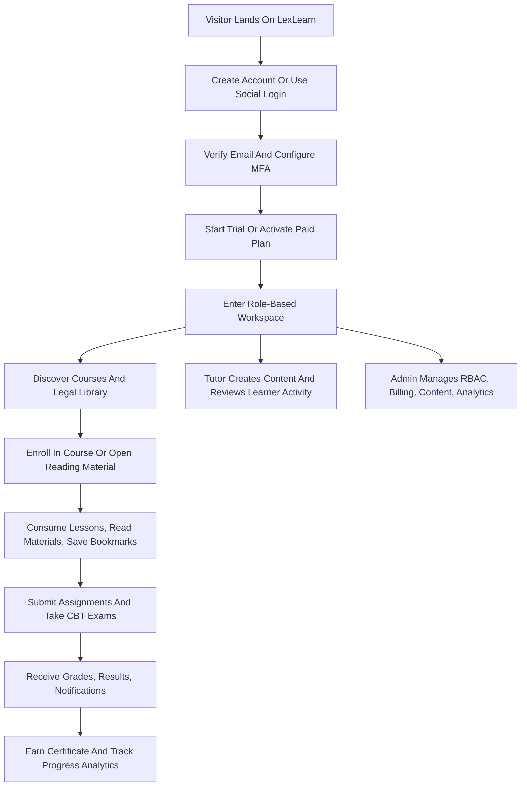

## 1. Product Overview
LexLearn is a subscription-based legal learning platform for web and mobile that combines a digital law library, structured courses, CBT examinations, assignments, community discussion, and enterprise analytics in a single ecosystem.
- The product serves law firms, law schools, legal educators, bar preparation providers, and professional legal institutions that need secure, scalable digital legal education infrastructure.
- The market value comes from combining LMS, legal content delivery, assessment, certification, and compliance-oriented administration into a platform tailored specifically for legal education rather than generic online learning.

## 2. Core Features

### 2.1 User Roles
| Role | Registration Method | Core Permissions |
|------|---------------------|------------------|
| Super Admin | Seeded system account | Full platform access, tenant governance, billing oversight, RBAC management, audit review |
| Administrator | Invite only | Institution-wide configuration, user administration, course and library oversight |
| Academic Administrator | Invite only | Academic planning, curriculum setup, schedules, exam orchestration, certificate policies |
| Tutor | Invite only or approved onboarding | Create and manage courses, lessons, assignments, exams, grading, announcements, live sessions |
| Student | Email, Google, Apple, Facebook, invite, enterprise import | Enroll, learn, read, take exams, submit assignments, join discussions, manage subscription |
| Moderator | Invite only | Community moderation, abuse reports, spam removal, discussion pinning, limited user sanctions |
| Support Staff | Invite only | Help desk actions, account support, verification assistance, notification support |
| Finance Officer | Invite only | Payment review, invoices, transaction reconciliation, subscription reporting |

### 2.2 Feature Modules
1. **Marketing and acquisition**: landing page, pricing, institutions, testimonials, legal specialties, CTA flows.
2. **Authentication and identity**: email/password, social login, MFA, verification, reset password, session and device management.
3. **Student learning workspace**: dashboard, enrolled courses, continue learning, reading history, bookmarks, assignments, exams, certificates.
4. **Tutor workspace**: course authoring, lesson sequencing, study material uploads, assignment setup, exam banks, grading, live session management.
5. **Admin control center**: user management, RBAC, subscriptions, billing, coupons, content governance, audit logs, analytics.
6. **Digital law library**: searchable legal materials, reading progress, notes, highlights, offline-ready downloads, recommendations.
7. **Course delivery**: modules, lessons, videos, readings, downloadable resources, ratings, progress tracking.
8. **CBT examination engine**: timed exams, question pools, randomized questions and answers, auto grading, manual grading, analytics, certificates.
9. **Assignments**: brief downloads, submissions, deadlines, tutor feedback, rubric-based grading, attachments.
10. **Community**: question and answer discussions, comments, replies, topic following, abuse reporting, moderation.
11. **Subscriptions and payments**: plan selection, trial, upgrades, downgrades, invoicing, coupons, payment history, renewal control.
12. **Notifications and announcements**: push, email, in-app, announcement banners, reminders, engagement messaging.
13. **Live classes**: Zoom, Google Meet, Teams integration, attendance, recording links, replay access, polls, chat metadata.
14. **Certificates and verification**: downloadable certificates, QR verification, unique serial numbers, completion rules.
15. **Search and analytics**: global search across learning and library resources, learner analytics, institutional KPIs, finance dashboards.

### 2.3 Page Details
| Page Name | Module Name | Feature Description |
|-----------|-------------|---------------------|
| Landing | Hero, trust proof, pricing teaser, featured legal tracks | Premium legal-tech positioning, institution-focused conversion, responsive CTA paths |
| Pricing | Plan matrix, FAQ, coupon entry, enterprise inquiry | Supports free trial, monthly, quarterly, annual, enterprise comparisons |
| Sign In / Sign Up | Auth forms, SSO, MFA, device prompts | Secure onboarding with progressive verification and strong validation |
| Student Dashboard | Progress summary, streak, deadlines, recommendations, subscription card | Personalized overview of learning activity, upcoming tasks, and account state |
| Course Catalog | Search, filters, cards, sort, categories | Legal-domain discovery by practice area, difficulty, institution, tutor, and format |
| Course Detail | Overview, syllabus, tutor bio, reviews, enrollment | Shows modules, prerequisites, materials, progress entry point, rating summary |
| Learning Player | Video, reading pane, notes, bookmarks, progress tracker | Continuous learning with lesson completion, download access, and contextual materials |
| Library Explorer | Search, filters, tags, collections, continue reading | Supports books, statutes, case law, PDFs, DOCX, EPUB, PPT, media, and recommendations |
| Reader | Document viewer, highlights, notes, reading timer, bookmarks | Tracks reading progress, supports annotations, download rights, and resume state |
| Assignment Center | Assignment brief, submission history, upload area, deadline timer | Enables draft editing before deadline and feedback review after grading |
| Exam Workspace | Question renderer, timer, navigation palette, submission confirmation | Handles multiple question types, autosave, anti-loss recovery, and result flow |
| Community Hub | Topic feed, ask form, answer composer, moderation controls | Stack Overflow-style legal discussion with voting, accepted answers, and mentions |
| Live Session Page | Session details, attendance, join CTA, recording access | Integrates external meeting providers while keeping class context inside LexLearn |
| Subscription Settings | Current plan, invoice list, payment methods, renewal controls | Supports upgrades, downgrades, trial conversion, coupons, and transaction review |
| Certificates | Certificate gallery, verification actions, QR preview | Displays earned credentials and downloadable artifacts |
| Tutor Studio | Course builder, lesson editor, question bank, analytics | Gives tutors structured authoring tools for legal education workflows |
| Admin Dashboard | Revenue, users, content health, failed payments, growth charts | Cross-functional institutional insight for academic, operational, and finance teams |

## 3. Core Process
Primary platform journeys:
- A visitor discovers LexLearn through the public site, reviews pricing or enterprise options, registers, verifies identity, activates a subscription, and enters the student workspace.
- A student enrolls in a course, consumes lessons and legal reading materials, submits assignments, takes CBT exams, earns certificates, and receives personalized recommendations.
- A tutor authors course content, uploads library materials, configures assignments and exams, hosts live sessions, grades student work, and monitors learner progress.
- An administrator manages users, roles, permissions, subscriptions, payments, content governance, analytics, and compliance reporting.

## 4. User Interface Design
### 4.1 Design Style
- Visual direction: premium legal-tech editorial aesthetic with enterprise SaaS clarity.
- Primary colors: deep midnight navy, ivory, graphite, and restrained gold accents for authority and trust.
- Secondary colors: emerald for success, amber for warnings, crimson for risk states, cobalt for active learning actions.
- Button style: rounded-rectangular controls with subtle glass overlays, crisp shadows, and strong focus states.
- Typography: a distinctive editorial serif for headings paired with a highly legible humanist sans-serif for body and UI text.
- Layout style: desktop-first dashboards, spacious card systems, layered panels, sticky side navigation, and immersive content workspaces.
- Motion: restrained but polished transitions, staggered reveals, progress-driven micro-interactions, and low-distraction chart animation.
- Icon style: clean outlined icons with legal-education metaphors, minimal illustration, and limited ornament.

### 4.2 Page Design Overview
| Page Name | Module Name | UI Elements |
|-----------|-------------|-------------|
| Landing | Hero | Bold editorial typography, institutional proof blocks, subtle animated gradients, premium CTA treatment |
| Student Dashboard | Analytics cards | Ring charts, streak widgets, deadline rails, recommendation carousels, dark/light adaptable panels |
| Learning Player | Lesson workspace | Split-pane layout, sticky progress rail, annotation drawer, media controls, contextual downloads |
| Reader | Reading surface | High legibility typography, reading ruler, highlight palette, note popovers, progress footer |
| Exam Workspace | Question canvas | Distraction-free layout, timer emphasis, answer state indicators, autosave hints, confidence controls |
| Community Hub | Feed and thread layout | Voting rails, accepted answer badges, mention chips, moderation states, topic chips |
| Tutor Studio | Authoring forms | Step-based builders, drag-order lists, upload cards, preview panes, validation feedback |
| Admin Dashboard | Analytics cockpit | Dense but readable KPI grids, trend charts, cohort tables, audit and payment alerts |

### 4.3 Responsiveness
- Desktop-first implementation with mobile-adaptive layouts for all public pages and application surfaces.
- Web layouts collapse into touch-friendly stacked panels below tablet breakpoints.
- Mobile apps prioritize bottom navigation, quick resume, downloads, biometric access, and low-friction task completion.
- Accessibility target is WCAG AA with keyboard navigation, semantic structure, focus visibility, color contrast, and reduced-motion support.

### 4.4 Delivery Scope and Phasing
- Phase 1: authentication, RBAC foundation, subscriptions, student dashboard, course delivery, digital library, assignments, CBT basics, notifications, admin core.
- Phase 2: tutor studio expansion, community, advanced analytics, certificates, live classes, offline mobile experience, richer billing operations.
- Phase 3: enterprise tenancy features, advanced recommendation engine, deeper proctoring, institution analytics, integrations, and AI-assisted learning enhancements.
