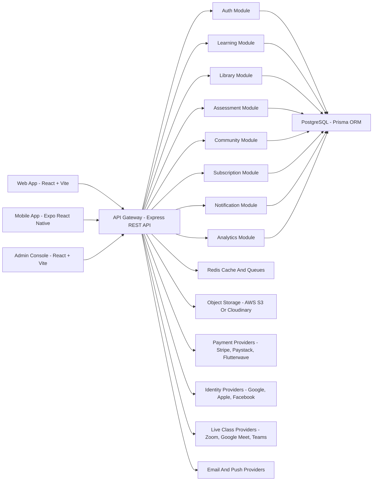
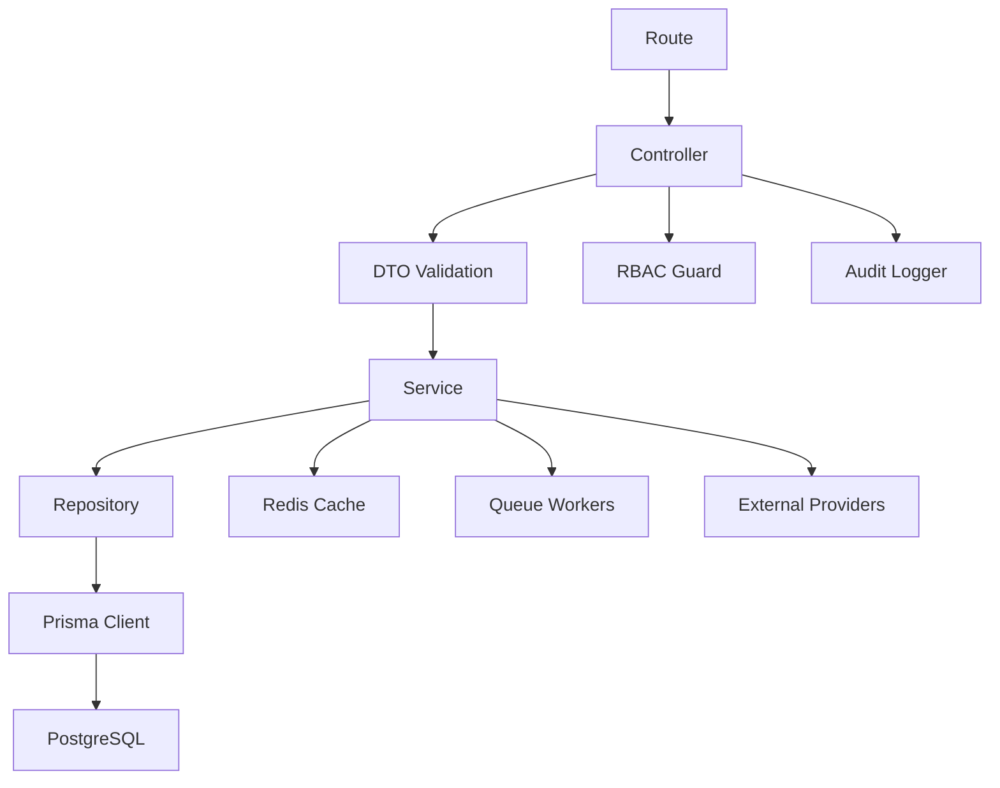

## 1. Architecture Design


## 2. Technology Description
- Frontend web: React 18 + Vite + TypeScript + Tailwind CSS + React Router + TanStack Query + Zustand + React Hook Form + Zod + Axios + Framer Motion.
- Mobile app: Expo + React Native + TypeScript + Expo Router + TanStack Query + Zustand + NativeWind + Expo Notifications + Expo Secure Store.
- Backend: Node.js LTS + Express.js + TypeScript + Prisma ORM + PostgreSQL + Redis.
- Authentication: JWT access tokens, refresh tokens, secure password hashing with bcrypt, MFA, device/session management, social login.
- Infrastructure: Docker, Nginx, GitHub Actions, Render or Railway or DigitalOcean deployment, SSL termination, environment-based configuration.
- Storage: PostgreSQL for relational data, Redis for caching and background job coordination, S3-compatible object storage for documents and media.
- Documentation and quality: OpenAPI Swagger, ESLint, Prettier, Husky, unit tests, integration tests, API tests, end-to-end tests.

## 3. Monorepo Structure
```text
apps/
  web/
  mobile/
  api/
packages/
  ui/
  config/
  types/
  eslint-config/
  tsconfig/
infrastructure/
  docker/
  nginx/
  github-actions/
docs/
prisma/
```

## 4. Route Definitions
| Route | Purpose |
|-------|---------|
| / | Marketing landing page, product narrative, CTA flows |
| /pricing | Subscription plans, enterprise inquiry, FAQs |
| /auth/sign-in | Email and social sign-in |
| /auth/sign-up | Role-aware registration and onboarding |
| /auth/verify-email | Email verification completion |
| /auth/forgot-password | Password recovery request |
| /auth/reset-password | Password reset completion |
| /app/dashboard | Student dashboard with progress, deadlines, and recommendations |
| /app/courses | Course catalog and enrollment discovery |
| /app/courses/:courseSlug | Course detail, syllabus, rating, enrollment |
| /app/learn/:courseId/:lessonId | Lesson player with resources and progress |
| /app/library | Library explorer with search and filters |
| /app/library/:materialId | Reader or media viewer for legal content |
| /app/assignments | Assignment list, deadline tracking, submission status |
| /app/assignments/:assignmentId | Assignment details, upload, feedback review |
| /app/exams | Exam dashboard and history |
| /app/exams/:examId/start | CBT exam workspace |
| /app/community | Topic feed and question discovery |
| /app/community/:topicId | Question, answers, comments, moderation state |
| /app/certificates | Certificate gallery and verification entry |
| /app/subscription | Current plan, invoices, payment methods, coupon actions |
| /tutor | Tutor workspace overview |
| /tutor/courses/new | Course creation wizard |
| /tutor/courses/:courseId | Course editing and publishing |
| /tutor/exams/:examId | Question pool and exam configuration |
| /admin | Admin dashboard with KPIs |
| /admin/users | User management and RBAC configuration |
| /admin/content | Course, library, and moderation governance |
| /admin/subscriptions | Plans, invoices, transactions, payment review |
| /admin/analytics | Revenue, learner, and content analytics |

## 5. API Definitions
### 5.1 Shared Response Envelope
```ts
type ApiSuccess<T> = {
  success: true;
  data: T;
  meta?: {
    page?: number;
    pageSize?: number;
    total?: number;
    nextCursor?: string | null;
  };
};

type ApiError = {
  success: false;
  error: {
    code: string;
    message: string;
    details?: Record<string, unknown>;
  };
};
```

### 5.2 Authentication Contracts
```ts
type SignInRequest = {
  email: string;
  password: string;
  deviceName?: string;
  rememberMe?: boolean;
};

type AuthSession = {
  accessToken: string;
  refreshToken: string;
  expiresIn: number;
  user: {
    id: string;
    fullName: string;
    email: string;
    roleCodes: string[];
    institutionId?: string | null;
    twoFactorEnabled: boolean;
  };
};
```

### 5.3 Learning Contracts
```ts
type CourseSummary = {
  id: string;
  slug: string;
  title: string;
  category: string;
  tutorName: string;
  level: "beginner" | "intermediate" | "advanced";
  thumbnailUrl?: string | null;
  averageRating: number;
  enrollmentCount: number;
  isEnrolled: boolean;
};

type LessonProgressUpdate = {
  lessonId: string;
  completed: boolean;
  watchedSeconds?: number;
  readingProgressPercent?: number;
};
```

### 5.4 Assessment Contracts
```ts
type ExamStartResponse = {
  attemptId: string;
  examId: string;
  startedAt: string;
  endsAt: string;
  sections: Array<{
    id: string;
    title: string;
    questionCount: number;
  }>;
};

type ExamAnswerPayload = {
  attemptId: string;
  questionId: string;
  answer: string[] | string | boolean | null;
  flagged?: boolean;
};
```

### 5.5 Billing Contracts
```ts
type SubscriptionPlan = {
  id: string;
  code: string;
  name: string;
  billingInterval: "trial" | "monthly" | "quarterly" | "annual" | "enterprise";
  priceMinor: number;
  currency: string;
  isActive: boolean;
  featureFlags: string[];
};

type CheckoutSessionRequest = {
  planCode: string;
  couponCode?: string;
  provider: "stripe" | "paystack" | "flutterwave";
};
```

### 5.6 Representative REST Endpoints
| Method | Endpoint | Purpose |
|--------|----------|---------|
| POST | /api/v1/auth/sign-up | Register a user and create verification flow |
| POST | /api/v1/auth/sign-in | Authenticate and issue tokens |
| POST | /api/v1/auth/refresh | Rotate refresh token and issue new access token |
| POST | /api/v1/auth/verify-email | Complete email verification |
| POST | /api/v1/auth/forgot-password | Request reset token |
| POST | /api/v1/auth/reset-password | Reset password |
| GET | /api/v1/users/me | Fetch current user profile and role state |
| GET | /api/v1/courses | List courses with filters and pagination |
| POST | /api/v1/courses/:courseId/enroll | Enroll current student into a course |
| GET | /api/v1/library/materials | Search library materials |
| PATCH | /api/v1/progress/lessons/:lessonId | Update lesson completion or reading progress |
| GET | /api/v1/assignments | List assignments for learner or tutor context |
| POST | /api/v1/assignments/:assignmentId/submissions | Create or replace draft submission |
| POST | /api/v1/exams/:examId/start | Start a CBT attempt |
| POST | /api/v1/exam-attempts/:attemptId/answers | Save or replace an answer |
| POST | /api/v1/exam-attempts/:attemptId/submit | Submit exam for grading |
| GET | /api/v1/community/topics | List discussion topics |
| POST | /api/v1/community/topics | Create question or discussion topic |
| POST | /api/v1/subscriptions/checkout | Create payment checkout session |
| GET | /api/v1/analytics/admin/overview | Return admin KPI dashboard data |

## 6. Backend Module Architecture
### 6.1 Module Layout
```text
src/
  modules/
    auth/
    users/
    roles/
    institutions/
    courses/
    library/
    assignments/
    exams/
    community/
    subscriptions/
    payments/
    notifications/
    analytics/
    certificates/
    search/
    files/
    audit/
  shared/
    config/
    db/
    errors/
    middleware/
    security/
    utils/
```

### 6.2 Server Architecture Diagram


### 6.3 Architectural Principles
- Use clean module boundaries so each domain owns its DTOs, services, repositories, policies, and events.
- Apply repository pattern around Prisma only where it protects business complexity or enables testing; avoid over-abstraction for trivial reads.
- Prefer stateless REST handlers with explicit validation and response typing.
- Keep authorization policy-based: `role -> permission -> scoped resource access`.
- Push long-running jobs such as email delivery, certificate rendering, invoice generation, and media processing into background workers.
- Introduce Redis caching for course catalog, search facets, dashboard aggregates, and short-lived exam/session state.

## 7. Data Model
### 7.1 Base Table Convention
Every table includes:
- `id UUID PRIMARY KEY`
- `created_at TIMESTAMPTZ NOT NULL DEFAULT now()`
- `updated_at TIMESTAMPTZ NOT NULL DEFAULT now()`
- `deleted_at TIMESTAMPTZ NULL`

### 7.2 Core Entity Groups
| Domain | Tables |
|--------|--------|
| Identity and access | users, roles, permissions, role_permissions, user_roles, sessions, devices, password_resets, email_verifications, two_factor_methods |
| Academic people | students, tutors, institutions, user_profiles |
| Learning | categories, courses, course_categories, modules, lessons, enrollments, progress_tracking, study_materials, bookmarks, reading_history, notes, highlights |
| Assessment | assignments, assignment_submissions, exams, exam_sections, cbt_questions, cbt_answers, exam_attempts, exam_results, question_pools |
| Community | discussion_topics, discussion_answers, comments, replies, topic_follows, votes, abuse_reports |
| Commerce | subscription_plans, subscriptions, coupons, payments, transactions, invoices |
| Communication | notifications, notification_preferences, announcements, live_sessions, live_attendance |
| Trust and compliance | certificates, certificate_verifications, activity_logs, audit_logs |

### 7.3 ER Diagram

```mermaid
erDiagram
    USERS ||--o{ USER_ROLES : "has"
    ROLES ||--o{ USER_ROLES : "assigns"
    ROLES ||--o{ ROLE_PERMISSIONS : "grants"
    PERMISSIONS ||--o{ ROLE_PERMISSIONS : "maps"
    USERS ||--|| STUDENTS : "extends"
    USERS ||--|| TUTORS : "extends"
    USERS ||--o{ SESSIONS : "owns"
    USERS ||--o{ DEVICES : "registers"
    CATEGORIES ||--o{ COURSE_CATEGORIES : "maps"
    COURSES ||--o{ COURSE_CATEGORIES : "maps"
    COURSES ||--o{ MODULES : "contains"
    MODULES ||--o{ LESSONS : "contains"
    COURSES ||--o{ STUDY_MATERIALS : "includes"
    STUDENTS ||--o{ ENROLLMENTS : "creates"
    COURSES ||--o{ ENROLLMENTS : "receives"
    LESSONS ||--o{ PROGRESS_TRACKING : "tracks"
    STUDENTS ||--o{ PROGRESS_TRACKING : "owns"
    STUDY_MATERIALS ||--o{ READING_HISTORY : "tracks"
    STUDENTS ||--o{ READING_HISTORY : "creates"
    STUDY_MATERIALS ||--o{ BOOKMARKS : "bookmarks"
    COURSES ||--o{ ASSIGNMENTS : "contains"
    ASSIGNMENTS ||--o{ ASSIGNMENT_SUBMISSIONS : "receives"
    STUDENTS ||--o{ ASSIGNMENT_SUBMISSIONS : "submits"
    COURSES ||--o{ EXAMS : "contains"
    EXAMS ||--o{ CBT_QUESTIONS : "contains"
    CBT_QUESTIONS ||--o{ CBT_ANSWERS : "offers"
    EXAMS ||--o{ EXAM_ATTEMPTS : "creates"
    STUDENTS ||--o{ EXAM_ATTEMPTS : "starts"
    EXAM_ATTEMPTS ||--|| EXAM_RESULTS : "produces"
    USERS ||--o{ DISCUSSION_TOPICS : "authors"
    DISCUSSION_TOPICS ||--o{ DISCUSSION_ANSWERS : "receives"
    USERS ||--o{ DISCUSSION_ANSWERS : "authors"
    USERS ||--o{ NOTIFICATIONS : "receives"
    USERS ||--o{ CERTIFICATES : "earns"
    SUBSCRIPTION_PLANS ||--o{ SUBSCRIPTIONS : "backs"
    USERS ||--o{ SUBSCRIPTIONS : "holds"
    SUBSCRIPTIONS ||--o{ PAYMENTS : "collects"
    PAYMENTS ||--o{ TRANSACTIONS : "records"
```


### 7.4 Representative DDL
```sql
CREATE EXTENSION IF NOT EXISTS "pgcrypto";

CREATE TABLE users (
  id UUID PRIMARY KEY DEFAULT gen_random_uuid(),
  email VARCHAR(255) NOT NULL UNIQUE,
  password_hash TEXT,
  full_name VARCHAR(180) NOT NULL,
  phone_number VARCHAR(32),
  avatar_url TEXT,
  status VARCHAR(32) NOT NULL DEFAULT 'pending',
  email_verified_at TIMESTAMPTZ,
  two_factor_enabled BOOLEAN NOT NULL DEFAULT FALSE,
  last_login_at TIMESTAMPTZ,
  created_at TIMESTAMPTZ NOT NULL DEFAULT now(),
  updated_at TIMESTAMPTZ NOT NULL DEFAULT now(),
  deleted_at TIMESTAMPTZ
);

CREATE TABLE roles (
  id UUID PRIMARY KEY DEFAULT gen_random_uuid(),
  code VARCHAR(64) NOT NULL UNIQUE,
  name VARCHAR(120) NOT NULL,
  description TEXT,
  created_at TIMESTAMPTZ NOT NULL DEFAULT now(),
  updated_at TIMESTAMPTZ NOT NULL DEFAULT now(),
  deleted_at TIMESTAMPTZ
);

CREATE TABLE permissions (
  id UUID PRIMARY KEY DEFAULT gen_random_uuid(),
  code VARCHAR(128) NOT NULL UNIQUE,
  name VARCHAR(150) NOT NULL,
  description TEXT,
  created_at TIMESTAMPTZ NOT NULL DEFAULT now(),
  updated_at TIMESTAMPTZ NOT NULL DEFAULT now(),
  deleted_at TIMESTAMPTZ
);

CREATE TABLE user_roles (
  id UUID PRIMARY KEY DEFAULT gen_random_uuid(),
  user_id UUID NOT NULL REFERENCES users(id),
  role_id UUID NOT NULL REFERENCES roles(id),
  created_at TIMESTAMPTZ NOT NULL DEFAULT now(),
  updated_at TIMESTAMPTZ NOT NULL DEFAULT now(),
  deleted_at TIMESTAMPTZ,
  UNIQUE (user_id, role_id)
);

CREATE TABLE courses (
  id UUID PRIMARY KEY DEFAULT gen_random_uuid(),
  slug VARCHAR(180) NOT NULL UNIQUE,
  title VARCHAR(255) NOT NULL,
  summary TEXT,
  description TEXT,
  tutor_id UUID REFERENCES tutors(id),
  difficulty_level VARCHAR(32) NOT NULL DEFAULT 'beginner',
  status VARCHAR(32) NOT NULL DEFAULT 'draft',
  price_minor INTEGER NOT NULL DEFAULT 0,
  currency VARCHAR(8) NOT NULL DEFAULT 'USD',
  created_at TIMESTAMPTZ NOT NULL DEFAULT now(),
  updated_at TIMESTAMPTZ NOT NULL DEFAULT now(),
  deleted_at TIMESTAMPTZ
);

CREATE TABLE study_materials (
  id UUID PRIMARY KEY DEFAULT gen_random_uuid(),
  course_id UUID REFERENCES courses(id),
  category_id UUID REFERENCES categories(id),
  title VARCHAR(255) NOT NULL,
  material_type VARCHAR(32) NOT NULL,
  storage_url TEXT NOT NULL,
  searchable_text TSVECTOR,
  is_downloadable BOOLEAN NOT NULL DEFAULT TRUE,
  created_at TIMESTAMPTZ NOT NULL DEFAULT now(),
  updated_at TIMESTAMPTZ NOT NULL DEFAULT now(),
  deleted_at TIMESTAMPTZ
);

CREATE TABLE exams (
  id UUID PRIMARY KEY DEFAULT gen_random_uuid(),
  course_id UUID REFERENCES courses(id),
  title VARCHAR(255) NOT NULL,
  exam_type VARCHAR(32) NOT NULL DEFAULT 'cbt',
  duration_minutes INTEGER NOT NULL,
  randomize_questions BOOLEAN NOT NULL DEFAULT TRUE,
  randomize_answers BOOLEAN NOT NULL DEFAULT TRUE,
  negative_marking_enabled BOOLEAN NOT NULL DEFAULT FALSE,
  pass_mark NUMERIC(5,2),
  published_at TIMESTAMPTZ,
  created_at TIMESTAMPTZ NOT NULL DEFAULT now(),
  updated_at TIMESTAMPTZ NOT NULL DEFAULT now(),
  deleted_at TIMESTAMPTZ
);

CREATE TABLE subscriptions (
  id UUID PRIMARY KEY DEFAULT gen_random_uuid(),
  user_id UUID NOT NULL REFERENCES users(id),
  subscription_plan_id UUID NOT NULL REFERENCES subscription_plans(id),
  status VARCHAR(32) NOT NULL,
  starts_at TIMESTAMPTZ NOT NULL,
  ends_at TIMESTAMPTZ,
  auto_renew BOOLEAN NOT NULL DEFAULT TRUE,
  provider VARCHAR(32) NOT NULL,
  external_reference VARCHAR(255),
  created_at TIMESTAMPTZ NOT NULL DEFAULT now(),
  updated_at TIMESTAMPTZ NOT NULL DEFAULT now(),
  deleted_at TIMESTAMPTZ
);

CREATE INDEX idx_users_status ON users(status) WHERE deleted_at IS NULL;
CREATE INDEX idx_courses_status ON courses(status) WHERE deleted_at IS NULL;
CREATE INDEX idx_materials_search ON study_materials USING GIN(searchable_text);
CREATE INDEX idx_subscriptions_user_status ON subscriptions(user_id, status) WHERE deleted_at IS NULL;
```

## 8. Security and Compliance
- Enforce HTTPS at the edge and secure cookies or secure token storage strategies per platform.
- Hash passwords with bcrypt and rotate refresh tokens on every refresh event.
- Add rate limiting, request size limits, MIME validation, antivirus hooks for uploads, and signed object URLs.
- Sanitize rich text, validate DTOs with Zod or class-based schemas, and parameterize all Prisma-backed queries.
- Track privileged actions in `audit_logs` and user-facing actions in `activity_logs`.
- Support soft delete patterns plus compliance-safe archival for financial and academic records.

## 9. Performance and Scalability
- Use cursor pagination for large feeds, search results, and discussion threads.
- Cache read-heavy aggregates and catalog endpoints in Redis with explicit invalidation rules.
- Split heavy analytics and notification workflows into asynchronous jobs.
- Optimize Prisma queries with relation selection, explicit indexes, and precomputed aggregates where justified.
- Serve media through CDN-backed object storage and generate responsive image assets where applicable.

## 10. Testing and Delivery
- Unit tests cover services, authorization policies, utilities, and DTO validation.
- Integration tests cover modules against a test database and Redis.
- API tests validate contracts, auth flows, billing flows, and permission boundaries.
- End-to-end tests cover sign-up, enrollment, learning progression, assignment submission, exam completion, and admin billing review.
- CI pipeline runs lint, typecheck, test, Prisma validation, build, and deployment promotion.
- Docker compose supports local development with API, PostgreSQL, Redis, and reverse proxy services.
